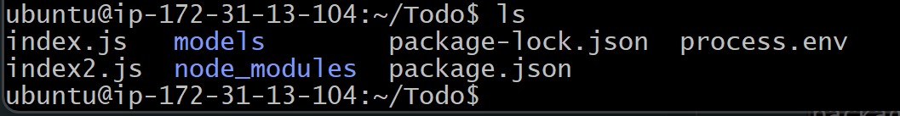

# Project-3: MERN STACK IMPLEMENTATION

## Step 1 - Backend Configuration

`sudo apt update`

`sudo apt upgrade`

`curl -fsSL https://deb.nodesource.com/setup_18.x | sudo -E bash -`

### Install and configure Node.js

`sudo apt-get install -y nodejs`

`node -v`

`npm -v`

### create Todo directory

`mkdir Todo`

`cd Todo`

`npm init`

### InstallexpressJs

`npm install express`

`touch index.js`

`ls`

`npm install dotenv`

`touch index.js`

`vim index.js`

`node index.js`

### create directory for route

`mkdir routes`

` cd routes`

`touch api.js`

`vim api.js`

### install mongoose DB

`npm install mongoose`

`mkdir models`

`cd models`

`touch todo.js`

`vim todo.js`

`vim api.js`

### Mongodb Database

`touch .env`

` vim .env`

`node index.js`

### Use Postman to test API

### Frontend creation

` npx create-react-app client`

`npm install concurrently --save-dev`

`npm install nodemon --save-dev`

change directory to client

`cd client`

`vi package.json`

`npm run dev`

`npm install axios`

### Todo App

